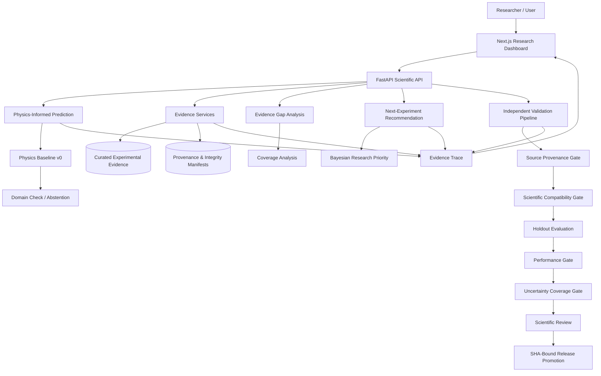
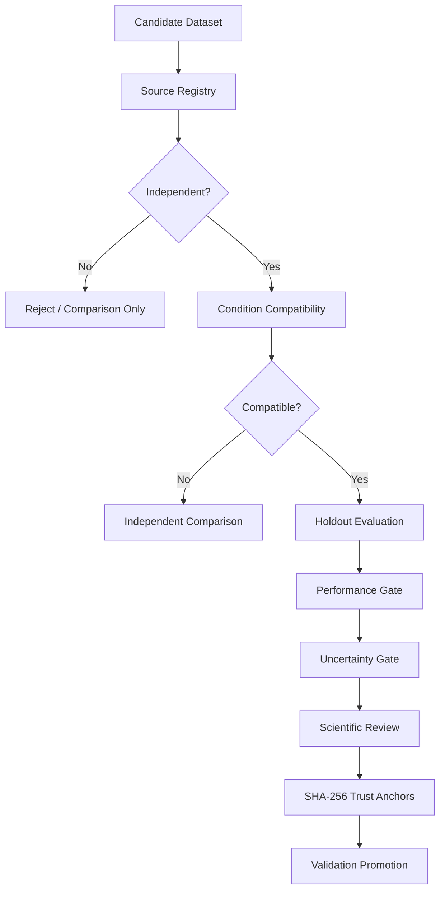

# 🔥 FireSense

### Evidence-Grounded Reduced-Gravity Fire Behavior Intelligence & Decision Support

[](https://github.com/kjanuda/JKoDe_FireSense/releases)
[](https://fastapi.tiangolo.com/)
[](https://nextjs.org/)
[](#testing)
[](#scientific-validation-status)

**FireSense** is a research-oriented decision-support platform for studying and reasoning about **reduced-gravity fire behavior**.

Instead of presenting a black-box prediction, FireSense connects:

- curated experimental evidence,
- provenance and source integrity,
- physics-informed prediction,
- uncertainty-aware abstention,
- external evidence comparison,
- validation readiness checks,
- evidence-gap analysis,
- and next-experiment recommendation.

Its goal is to build a **living map of what is known, what conflicts, what remains uncertain, and which experiment could reduce uncertainty next**.

> **Important:** FireSense v0 is research software.
> It is **not** a fire-certification tool, spacecraft safety authority, or production operational system.

---

## Table of Contents

- [The Problem](#the-problem)
- [The FireSense Solution](#the-firesense-solution)
- [What FireSense Solves](#what-firesense-solves)
- [System Architecture](#system-architecture)
- [How It Works](#how-it-works)
- [Core Capabilities](#core-capabilities)
- [Scientific Scope](#scientific-scope)
- [Prediction Model](#prediction-model)
- [Evidence and Provenance](#evidence-and-provenance)
- [Validation Pipeline](#validation-pipeline)
- [Next-Experiment Recommendation](#next-experiment-recommendation)
- [Use Cases](#use-cases)
- [Advantages](#advantages)
- [Technology Stack](#technology-stack)
- [Repository Structure](#repository-structure)
- [Quick Start](#quick-start)
- [API](#api)
- [Testing](#testing)
- [Scientific Validation Status](#scientific-validation-status)
- [Limitations](#limitations)
- [Scientific Guardrails](#scientific-guardrails)
- [Roadmap](#roadmap)
- [Release](#release)
- [Team](#team)
- [Disclaimer](#disclaimer)

---

## The Problem

Fire behavior in reduced gravity is difficult to study because experimental opportunities are limited, expensive, short-duration, and distributed across different research campaigns.

Available fire-spread evidence may differ in:

- gravity regime,
- material geometry,
- sample thickness,
- oxygen concentration,
- pressure,
- imposed flow,
- transport configuration,
- measurement definition,
- experimental facility,
- uncertainty reporting,
- and provenance.

This creates several research problems.

### 1. Evidence is fragmented

Experimental results may be spread across reports, figures, publications, and separate research campaigns.

### 2. Similar-looking experiments may not actually be comparable

Two measurements can both report "flame spread rate" while using different:

- flow conditions,
- flame-front definitions,
- gravity configurations,
- geometries,
- or measurement procedures.

Treating them as directly interchangeable can create misleading conclusions.

### 3. A numerical prediction alone is not enough

A prediction without provenance, applicability limits, uncertainty context, validation state, and supporting evidence can create false confidence.

### 4. Experimental resources are limited

When only a small number of future experiments can be performed, an important question is:

> **Which experiment would reduce scientific uncertainty the most?**

---

## The FireSense Solution

FireSense addresses these problems through an **evidence-first architecture**.

Rather than asking only *"What value does the model predict?"*, FireSense also asks:

- Which evidence supports the prediction?
- Is the requested condition inside the supported domain?
- Does independent evidence agree?
- What uncertainties are present?
- Has this evidence actually passed the validation gates?
- Where is the largest evidence gap?
- What experiment should be prioritized next?

FireSense therefore combines **prediction + provenance + uncertainty + validation + experimental planning**.

---

## What FireSense Solves

| Research Problem | FireSense Approach |
|---|---|
| Fragmented experimental evidence | Curated datasets with source-linked provenance |
| Mixing theory and experiments | Experimental and theoretical evidence remain separated |
| Unsupported extrapolation | Selective prediction with abstention |
| False confidence from model output | Explicit release and validation status |
| Confusing comparison with validation | Comparison evidence and validation evidence are separate |
| Unknown source trust | Frozen validation-source registry |
| Holdout leakage | Validation evidence is training-ineligible |
| Unclear uncertainty | Experimental, digitization, and model uncertainty remain separate |
| Limited experiment opportunities | Evidence-gap and Bayesian next-experiment recommendation |
| Silent artifact modification | SHA-256 integrity verification |

---

## System Architecture



---

## How It Works

FireSense follows a **fail-closed** scientific workflow.

```text
Experimental source
        │
        ▼
Source ingestion / extraction
        │
        ▼
Curated evidence
        │
        ▼
Provenance + SHA integrity
        │
        ├──────────────► Evidence comparison
        │
        ▼
Supported-domain check
        │
        ▼
Physics-informed prediction
        │
        ├── Outside domain ──► Abstain
        │
        ▼
Evidence trace
        │
        ▼
Gap / uncertainty analysis
        │
        ▼
Next-experiment recommendation
```

Independent validation follows a stricter route:

```text
Independent external source
        │
        ▼
Trusted source registry
        │
        ▼
Condition compatibility
        │
        ▼
Holdout-only evaluation
        │
        ▼
Performance thresholds
        │
        ▼
Calibrated uncertainty coverage
        │
        ▼
Scientific review
        │
        ▼
SHA-bound approval
        │
        ▼
Validation release promotion
```

If any required gate fails, FireSense does not promote the scientific claim.

---

## Core Capabilities

### 1. Evidence-Grounded Prediction

FireSense predicts measurable fire behavior only within its explicitly supported empirical domain.

Current modeled quantity: **flame spread rate**.

The system does **not** claim to predict spacecraft cabin-fire probability, mission-level fire risk, crew survivability, certification outcomes, or complete spacecraft fire dynamics.

### 2. Selective Prediction and Abstention

FireSense avoids silently extrapolating outside the supported evidence domain. A request returns either `predict` or `abstain`, with explicit abstention reasons. Domain limitations are made visible instead of being hidden behind a numerical output.

### 3. Evidence Traceability

Predictions and research recommendations are connected to structured evidence. The system preserves:

- source identity,
- dataset identity,
- experimental conditions,
- training eligibility,
- validation eligibility,
- uncertainty metadata,
- comparison status,
- and artifact integrity.

### 4. External Evidence Comparison

Independent evidence can be used for comparison even when it is not scientifically compatible enough for direct validation.

For example, FireSense includes independent external comparison evidence from Ries, Eigenbrod & Meyer (2024). However, known condition and measurement differences prevent that comparison from being presented as completed independent external validation. This distinction is intentional.

### 5. Validation Readiness

FireSense includes a formal pipeline for determining whether an external dataset is eligible to validate the model. Checks include:

- independent publication or dataset,
- independent experimental campaign,
- no reuse of FireSense training evidence,
- experimental evidence only,
- material and geometry compatibility,
- explicit environmental conditions,
- transport compatibility,
- measurement compatibility,
- holdout integrity,
- provenance completeness,
- uncertainty preservation,
- performance acceptance,
- and scientific review.

### 6. Evidence Gap Analysis

FireSense identifies regions where evidence coverage is weak, moving the question from *"What does the current model predict?"* to *"Where does the current evidence base need another experiment?"*

### 7. Next-Experiment Recommendation

FireSense contains a Bayesian research-priority workflow for identifying informative candidate experiments. The current logic considers the joint uncertainty across the supported microgravity and normal-gravity evidence.

The current frozen candidate is a **research-priority recommendation only**. It is not automatically approved for execution.

---

## Scientific Scope

FireSense v0 focuses on a deliberately narrow scientific family.

| Parameter | Current v0 scope |
|---|---|
| Material | PMMA |
| Geometry | Thin sheet |
| Oxygen | 21% |
| Pressure | Approximately 101.325 kPa |
| Reduced-gravity transport | Opposed flow |
| Reference flow | 50 mm/s |
| Primary output | Flame spread rate |
| Gravity contexts | Microgravity and normal gravity |
| Intended role | Research decision support |

The narrow scope is intentional. FireSense prefers **explicit abstention over unsupported generalization**.

---

## Prediction Model

The current physics baseline uses the relationship:

$$
V = \frac{K}{\tau}
$$

where:

- $V$ = predicted flame spread rate,
- $K$ = gravity-regime-specific fitted coefficient,
- $\tau$ = sheet thickness.

Current frozen coefficients:

| Gravity regime | K |
|---|---|
| Microgravity | 204.244573 |
| Normal gravity | 213.686797 |

The model is only evaluated inside its supported empirical thickness domain.

> **Important:** The current descriptive residual factor is **not** a calibrated confidence interval.

FireSense keeps three uncertainty concepts separate:

1. experimental uncertainty,
2. digitization uncertainty,
3. model uncertainty.

---

## Evidence and Provenance

FireSense treats provenance as part of the scientific model, not as optional metadata.

### NASA BASS-II

Primary source: *NASA BASS-II Summary Report*, NASA Glenn Research Center, NTRS: 20210011385.

- **Figure 2.21** provides the canonical experimental evidence used by the current thin-sheet baseline.
- **Figure 2.22** is retained as within-source comparison evidence. It is **not** treated as independent external validation.

### Independent Comparison Evidence

Ries, Eigenbrod & Meyer (2024), *Effect of oxygen concentration, pressure, and opposed flow velocity on the flame spread along thin PMMA sheets*, Proceedings of the Combustion Institute.
DOI: [10.1016/j.proci.2024.105358](https://doi.org/10.1016/j.proci.2024.105358)

FireSense retains this source as independent external comparison evidence while keeping direct-validation blockers explicit.

---

## Validation Pipeline

FireSense uses a fail-closed external-validation architecture.



A `POST` request cannot promote scientific validation status. Promotion requires reviewed, frozen artifacts whose SHA-256 values match trusted release anchors.

---

## Next-Experiment Recommendation

FireSense also acts as an experimental-planning assistant. The system combines:

- evidence-spacing coverage,
- uncertainty-aware modeling,
- and Bayesian candidate selection.

The current frozen Bayesian candidate prioritizes a PMMA thin-sheet experiment near **143.31 µm** within the current research family.

> This is a research-priority candidate, **not** an experiment authorization.

---

## Use Cases

| Use case | Description |
|---|---|
| **Reduced-gravity combustion research** | Explore how flame spread behavior changes between gravity regimes while keeping experimental context visible. |
| **Literature and evidence synthesis** | Organize experimental values with provenance and prevent incompatible studies from being silently merged. |
| **Model evaluation** | Compare physics-model predictions against candidate holdout evidence. |
| **Research gap identification** | Identify regions where empirical evidence is sparse or uncertain. |
| **Experiment planning** | Prioritize the next experimental condition that may provide the most scientific information. |
| **Scientific review** | Expose the exact evidence, compatibility checks, uncertainty state, and validation status behind a result. |
| **Education and demonstration** | Show how scientific ML can combine experimental evidence, physics, provenance, abstention, uncertainty, and validation governance. |

---

## Advantages

- **Evidence first:** predictions are tied to experimental evidence instead of isolated numbers.
- **Explainable scientific boundaries:** the system exposes when and why a prediction should not be trusted.
- **Fail-closed validation:** unknown, incompatible, or unreviewed evidence cannot silently promote validation state.
- **Provenance-aware:** source identity is a first-class part of the pipeline.
- **Holdout protection:** validation data stays training-ineligible.
- **Integrity checking:** frozen scientific artifacts use SHA-256 verification.
- **Separation of evidence roles:** training evidence, within-source comparison, independent external comparison, and independent external validation are distinguished.
- **Uncertainty separation:** digitization, experimental, and model uncertainty are never silently combined.
- **Research planning:** the platform recommends where a new experiment may reduce uncertainty.
- **Full-stack interface:** researchers interact with scientific services through a web dashboard rather than raw scripts alone.

---

## Technology Stack

**Backend**

- Python 3.14, FastAPI, Pydantic v2
- NumPy, PyMuPDF, Docling, Matplotlib
- pytest, uv

**Scientific / Optimization**

- Physics-informed baseline
- Evidence-gap analysis
- Gaussian-process / Bayesian research artifacts
- BoTorch research workflow where applicable
- SHA-256 artifact integrity

**Frontend**

- Next.js 16, React 19, TypeScript
- Tailwind CSS, Recharts
- OpenAPI-generated TypeScript contracts

---

## Repository Structure

```text
FireSense/
│
├── apps/
│   ├── api/
│   │   ├── app/
│   │   │   ├── analysis/
│   │   │   ├── api/
│   │   │   ├── cli/
│   │   │   ├── core/
│   │   │   ├── extraction/
│   │   │   ├── models/
│   │   │   ├── repositories/
│   │   │   ├── retrieval/
│   │   │   ├── routers/
│   │   │   ├── schemas/
│   │   │   ├── science/
│   │   │   └── services/
│   │   └── tests/
│   │
│   └── web/
│       ├── public/
│       └── src/
│
├── data/
│   ├── curated/
│   ├── figures/
│   ├── manifests/
│   └── templates/
│
├── docs/
│   ├── api/
│   └── validation/
│
├── notebooks/
├── scripts/
├── dev.cmd
├── dev.ps1
└── README.md
```

Raw and local working datasets are intentionally excluded from the public release.

---

## Quick Start

### Requirements

- Python 3.14+
- Node.js 24+
- npm
- [uv](https://docs.astral.sh/uv/)

### 1. Clone

```bash
git clone https://github.com/kjanuda/JKoDe_FireSense.git
cd JKoDe_FireSense
```

### 2. Start the backend

```bash
cd apps/api
uv sync
uv run python -m uvicorn app.main:app --host 127.0.0.1 --port 8000
```

| Service | URL |
|---|---|
| API | http://127.0.0.1:8000 |
| Swagger | http://127.0.0.1:8000/docs |
| Health | http://127.0.0.1:8000/health |

### 3. Configure the frontend

Create `apps/web/.env.local`:

```env
NEXT_PUBLIC_FIRESENSE_API_URL=http://127.0.0.1:8000
```

### 4. Start the frontend

```bash
cd apps/web
npm install
npm run dev
```

Open http://localhost:3000.

---

## API

**Prediction**

```text
POST /api/predict/fire-behavior
POST /api/predict/fire-behavior/explain
```

**Experiment recommendation**

```text
GET /api/recommendations/next-experiment
GET /api/recommendations/next-experiment/explain
```

**Evidence**

```text
GET /api/evidence/figure-2-22
GET /api/evidence/external-comparison
```

**Validation**

```text
GET  /api/evidence/validation-readiness
GET  /api/evidence/validation-release-status
GET  /api/evidence/validation-scientific-review-status

GET  /api/evidence/validation-source-registry
POST /api/evidence/validation-source-check

POST /api/evidence/validation-candidate/evaluate
POST /api/evidence/validation-candidate/performance
POST /api/evidence/validation-candidate/uncertainty

POST /api/evidence/validation-dataset/import-csv
```

The complete generated OpenAPI specification is at [`docs/api/openapi.json`](docs/api/openapi.json).

---

## Testing

### Backend

```bash
cd apps/api
uv run python -m pytest -q
```

FireSense v0 final software audit: **202 passed, 0 failed**.

### Frontend

```bash
cd apps/web
npm run api:types
npm run typecheck
npm run lint
npm run build
```

The v0.1.0 release completed OpenAPI type generation, TypeScript checking, ESLint, and the Next.js production build.

---

## Scientific Validation Status

| Claim | Status |
|---|---|
| Independent external comparison | ✅ AVAILABLE |
| Independent external validation | ❌ NOT YET ESTABLISHED |
| Production-ready scientific claim | ❌ NOT ALLOWED |
| Certification claim | ❌ NOT ALLOWED |

This is an intentional fail-closed state. FireSense must not be described as independently externally validated until a compatible real holdout dataset passes:

1. source provenance review,
2. source independence,
3. experimental compatibility,
4. holdout integrity,
5. quantitative performance acceptance,
6. calibrated uncertainty coverage,
7. scientific review,
8. SHA-bound release promotion.

---

## Limitations

- **Narrow experimental domain:** the baseline focuses on PMMA thin-sheet behavior under a restricted set of conditions.
- **No arbitrary extrapolation:** unsupported material, geometry, atmosphere, transport, or thickness conditions may cause abstention.
- **External validation is incomplete:** independent comparison evidence exists, but independent external validation has not been established.
- **No calibrated prediction interval yet:** the model does not expose a validated calibrated prediction interval.
- **Not a certification system:** FireSense is not a substitute for NASA certification, engineering qualification, spacecraft fire-safety standards, mission safety review, or physical experiments.

---

## Scientific Guardrails

1. Experimental and theoretical evidence remain distinct.
2. Theory does not silently become training evidence.
3. Digitized samples from one curve are not treated as independent experiments.
4. Validation is grouped by source / campaign / run identity.
5. Unknown provenance fails closed.
6. Independent evidence is not automatically compatible evidence.
7. Comparison is not validation.
8. Validation is not certification.
9. Validation is not automatically production readiness.
10. Unsupported conditions abstain instead of silently extrapolating.
11. Experimental, digitization, and model uncertainty remain separate.
12. Numeric scientific claims must come from structured evidence or scientific computation.

---

## Roadmap

- Acquire a compatible independent holdout dataset
- Calibrated prediction intervals and conformal uncertainty calibration
- Additional PMMA experimental families and material families
- Explicit flow-velocity modeling
- Richer pressure and oxygen-condition models
- Multi-fidelity modeling when supported by evidence
- Expanded experiment-design optimization
- Improved provenance linking
- Automated scientific evidence ingestion
- Stronger reproducible release packaging

Any expansion should preserve the same evidence-first and fail-closed scientific philosophy.

---

## Release

- Current release: `firesense-v0.1.0`
- Repository: https://github.com/kjanuda/JKoDe_FireSense
- Detailed audit: [`docs/validation/FIRESENSE_V0_RELEASE_AUDIT.md`](docs/validation/FIRESENSE_V0_RELEASE_AUDIT.md)

---

## Team

**JKoDe**

FireSense was developed as an evidence-grounded research software project focused on reduced-gravity fire behavior, scientific traceability, and uncertainty-aware experiment planning.

---

## Disclaimer

FireSense is experimental research software. Outputs should be interpreted as research decision support and must **not** be treated as:

- safety certification,
- operational fire prediction,
- engineering qualification,
- or mission authorization.

Physical testing, domain experts, and formal safety processes remain essential.

---

<p align="center">
  <strong>FireSense</strong><br/>
  Evidence → Prediction → Uncertainty → Validation → Experiment
</p>