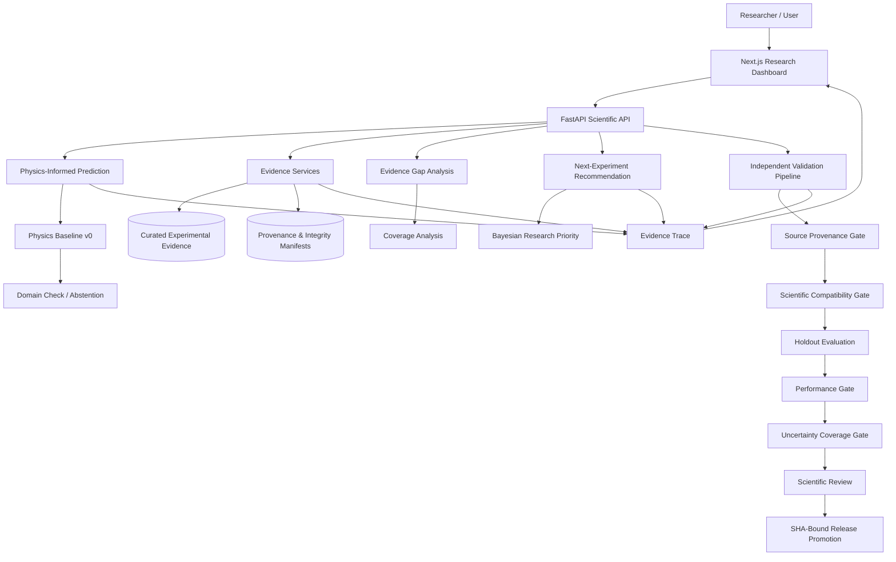
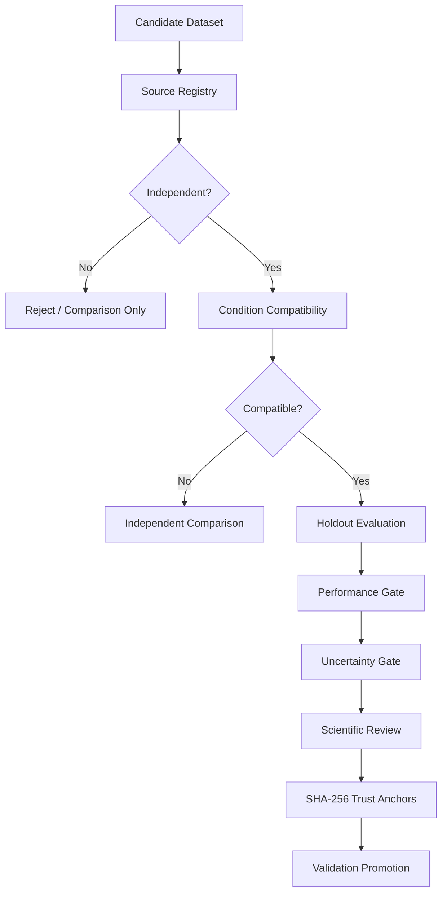

# 🔥 FireSense

### Evidence-Grounded Reduced-Gravity Fire Behavior Intelligence & Decision Support

[](https://github.com/kjanuda/JKoDe_FireSense/releases)
[](https://fastapi.tiangolo.com/)
[](https://nextjs.org/)
[](#testing)
[](#scientific-validation-status)

**FireSense** is a research-oriented decision-support platform for studying and reasoning about **reduced-gravity fire behavior**.

Instead of presenting a black-box prediction, FireSense connects:

- curated experimental evidence,
- provenance and source integrity,
- physics-informed prediction,
- uncertainty-aware abstention,
- external evidence comparison,
- validation readiness checks,
- evidence-gap analysis,
- and next-experiment recommendation.

Its goal is to build a **living map of what is known, what conflicts, what remains uncertain, and which experiment could reduce uncertainty next**.

> **Important:** FireSense v0 is research software.
> It is **not** a fire-certification tool, spacecraft safety authority, or production operational system.

---

## Release Snapshot

| Item | Status |
|---|---|
| Release | `firesense-v0.1.0` |
| Backend | FastAPI / Python 3.14 |
| Frontend | Next.js 16 / React 19 / TypeScript |
| Final backend audit | 202 tests passed, 0 failed |
| Independent external comparison | ✅ Available |
| Independent external validation | ❌ Not yet established |
| Production-ready scientific claim | ⛔ Not allowed |
| Certification claim | ⛔ Not allowed |
| Technical documentation | [PDF — Team JKoDe, October 2026](docs/FireSense_v0_1_0_Technical_Research_Documentation.pdf) |

> **Research software notice:** FireSense v0 is research decision-support software. It is not a fire-certification tool, spacecraft safety authority, flight-qualified system, or production operational system.

---

## Table of Contents

- [Release Snapshot](#release-snapshot)
- [The Problem](#the-problem)
- [The FireSense Solution](#the-firesense-solution)
- [What FireSense Solves](#what-firesense-solves)
- [System Architecture](#system-architecture)
- [How It Works](#how-it-works)
- [Core Capabilities](#core-capabilities)
- [Scientific Scope](#scientific-scope)
- [Prediction Model](#prediction-model)
- [Evidence and Provenance](#evidence-and-provenance)
- [Validation Pipeline](#validation-pipeline)
- [Next-Experiment Recommendation](#next-experiment-recommendation)
- [Use Cases](#use-cases)
- [Advantages](#advantages)
- [Scientific, Mathematical and Physical Foundations](#scientific-mathematical-and-physical-foundations)
- [Technology Stack](#technology-stack)
- [Repository Structure](#repository-structure)
- [Quick Start](#quick-start)
- [API](#api)
- [Testing](#testing)
- [Scientific Validation Status](#scientific-validation-status)
- [Limitations](#limitations)
- [Scientific Guardrails](#scientific-guardrails)
- [Roadmap](#roadmap)
- [Technical Documentation](#technical-documentation)
- [Release](#release)
- [Team](#team)
- [Disclaimer](#disclaimer)

---

## The Problem

Fire behavior in reduced gravity is difficult to study because experimental opportunities are limited, expensive, short-duration, and distributed across different research campaigns.

Available fire-spread evidence may differ in:

- gravity regime,
- material geometry,
- sample thickness,
- oxygen concentration,
- pressure,
- imposed flow,
- transport configuration,
- measurement definition,
- experimental facility,
- uncertainty reporting,
- and provenance.

This creates several research problems.

### 1. Evidence is fragmented

Experimental results may be spread across reports, figures, publications, and separate research campaigns.

### 2. Similar-looking experiments may not actually be comparable

Two measurements can both report "flame spread rate" while using different:

- flow conditions,
- flame-front definitions,
- gravity configurations,
- geometries,
- or measurement procedures.

Treating them as directly interchangeable can create misleading conclusions.

### 3. A numerical prediction alone is not enough

A prediction without provenance, applicability limits, uncertainty context, validation state, and supporting evidence can create false confidence.

### 4. Experimental resources are limited

When only a small number of future experiments can be performed, an important question is:

> **Which experiment would reduce scientific uncertainty the most?**

---

## The FireSense Solution

FireSense addresses these problems through an **evidence-first architecture**.

Rather than asking only *"What value does the model predict?"*, FireSense also asks:

- Which evidence supports the prediction?
- Is the requested condition inside the supported domain?
- Does independent evidence agree?
- What uncertainties are present?
- Has this evidence actually passed the validation gates?
- Where is the largest evidence gap?
- What experiment should be prioritized next?

FireSense therefore combines **prediction + provenance + uncertainty + validation + experimental planning**.

---

## What FireSense Solves

| Research Problem | FireSense Approach |
|---|---|
| Fragmented experimental evidence | Curated datasets with source-linked provenance |
| Mixing theory and experiments | Experimental and theoretical evidence remain separated |
| Unsupported extrapolation | Selective prediction with abstention |
| False confidence from model output | Explicit release and validation status |
| Confusing comparison with validation | Comparison evidence and validation evidence are separate |
| Unknown source trust | Frozen validation-source registry |
| Holdout leakage | Validation evidence is training-ineligible |
| Unclear uncertainty | Experimental, digitization, and model uncertainty remain separate |
| Limited experiment opportunities | Evidence-gap and Bayesian next-experiment recommendation |
| Silent artifact modification | SHA-256 integrity verification |

---

## System Architecture



---

## How It Works

FireSense follows a **fail-closed** scientific workflow.

```text
Experimental source
        │
        ▼
Source ingestion / extraction
        │
        ▼
Curated evidence
        │
        ▼
Provenance + SHA integrity
        │
        ├──────────────► Evidence comparison
        │
        ▼
Supported-domain check
        │
        ▼
Physics-informed prediction
        │
        ├── Outside domain ──► Abstain
        │
        ▼
Evidence trace
        │
        ▼
Gap / uncertainty analysis
        │
        ▼
Next-experiment recommendation
```

Independent validation follows a stricter route:

```text
Independent external source
        │
        ▼
Trusted source registry
        │
        ▼
Condition compatibility
        │
        ▼
Holdout-only evaluation
        │
        ▼
Performance thresholds
        │
        ▼
Calibrated uncertainty coverage
        │
        ▼
Scientific review
        │
        ▼
SHA-bound approval
        │
        ▼
Validation release promotion
```

If any required gate fails, FireSense does not promote the scientific claim.

---

## Core Capabilities

### 1. Evidence-Grounded Prediction

FireSense predicts measurable fire behavior only within its explicitly supported empirical domain.

Current modeled quantity: **flame spread rate**.

The system does **not** claim to predict spacecraft cabin-fire probability, mission-level fire risk, crew survivability, certification outcomes, or complete spacecraft fire dynamics.

### 2. Selective Prediction and Abstention

FireSense avoids silently extrapolating outside the supported evidence domain. A request returns either `predict` or `abstain`, with explicit abstention reasons. Domain limitations are made visible instead of being hidden behind a numerical output.

### 3. Evidence Traceability

Predictions and research recommendations are connected to structured evidence. The system preserves:

- source identity,
- dataset identity,
- experimental conditions,
- training eligibility,
- validation eligibility,
- uncertainty metadata,
- comparison status,
- and artifact integrity.

### 4. External Evidence Comparison

Independent evidence can be used for comparison even when it is not scientifically compatible enough for direct validation.

For example, FireSense includes independent external comparison evidence from Ries, Eigenbrod & Meyer (2024). However, known condition and measurement differences prevent that comparison from being presented as completed independent external validation. This distinction is intentional.

### 5. Validation Readiness

FireSense includes a formal pipeline for determining whether an external dataset is eligible to validate the model. Checks include:

- independent publication or dataset,
- independent experimental campaign,
- no reuse of FireSense training evidence,
- experimental evidence only,
- material and geometry compatibility,
- explicit environmental conditions,
- transport compatibility,
- measurement compatibility,
- holdout integrity,
- provenance completeness,
- uncertainty preservation,
- performance acceptance,
- and scientific review.

### 6. Evidence Gap Analysis

FireSense identifies regions where evidence coverage is weak, moving the question from *"What does the current model predict?"* to *"Where does the current evidence base need another experiment?"*

### 7. Next-Experiment Recommendation

FireSense contains a Bayesian research-priority workflow for identifying informative candidate experiments. The current logic considers the joint uncertainty across the supported microgravity and normal-gravity evidence.

The current frozen candidate is a **research-priority recommendation only**. It is not automatically approved for execution.

---

## Scientific Scope

FireSense v0 focuses on a deliberately narrow scientific family.

| Parameter | Current v0 scope |
|---|---|
| Material | PMMA |
| Geometry | Thin sheet |
| Oxygen | 21% |
| Pressure | Approximately 101.325 kPa |
| Reduced-gravity transport | Opposed flow |
| Reference flow | 50 mm/s |
| Primary output | Flame spread rate |
| Gravity contexts | Microgravity and normal gravity |
| Intended role | Research decision support |

The narrow scope is intentional. FireSense prefers **explicit abstention over unsupported generalization**.

---

## Prediction Model

The current physics baseline uses the relationship:

$$
V = \frac{K}{\tau}
$$

where:

- $V$ = predicted flame spread rate,
- $K$ = gravity-regime-specific fitted coefficient,
- $\tau$ = sheet thickness.

Current frozen coefficients:

| Gravity regime | K |
|---|---|
| Microgravity | 204.244573 |
| Normal gravity | 213.686797 |

The model is only evaluated inside its supported empirical thickness domain.

> **Important:** The current descriptive residual factor is **not** a calibrated confidence interval.

FireSense keeps three uncertainty concepts separate:

1. experimental uncertainty,
2. digitization uncertainty,
3. model uncertainty.

---

## Evidence and Provenance

FireSense treats provenance as part of the scientific model, not as optional metadata.

### NASA BASS-II

Primary source: *NASA BASS-II Summary Report*, NASA Glenn Research Center, NTRS: 20210011385.

- **Figure 2.21** provides the canonical experimental evidence used by the current thin-sheet baseline.
- **Figure 2.22** is retained as within-source comparison evidence. It is **not** treated as independent external validation.

### Independent Comparison Evidence

Ries, Eigenbrod & Meyer (2024), *Effect of oxygen concentration, pressure, and opposed flow velocity on the flame spread along thin PMMA sheets*, Proceedings of the Combustion Institute.
DOI: [10.1016/j.proci.2024.105358](https://doi.org/10.1016/j.proci.2024.105358)

FireSense retains this source as independent external comparison evidence while keeping direct-validation blockers explicit.

---

## Validation Pipeline

FireSense uses a fail-closed external-validation architecture.



A `POST` request cannot promote scientific validation status. Promotion requires reviewed, frozen artifacts whose SHA-256 values match trusted release anchors.

---

## Next-Experiment Recommendation

FireSense also acts as an experimental-planning assistant. The system combines:

- evidence-spacing coverage,
- uncertainty-aware modeling,
- and Bayesian candidate selection.

The current frozen Bayesian candidate prioritizes a PMMA thin-sheet experiment near **143.31 µm** within the current research family.

> This is a research-priority candidate, **not** an experiment authorization.

---

## Use Cases

| Use case | Description |
|---|---|
| **Reduced-gravity combustion research** | Explore how flame spread behavior changes between gravity regimes while keeping experimental context visible. |
| **Literature and evidence synthesis** | Organize experimental values with provenance and prevent incompatible studies from being silently merged. |
| **Model evaluation** | Compare physics-model predictions against candidate holdout evidence. |
| **Research gap identification** | Identify regions where empirical evidence is sparse or uncertain. |
| **Experiment planning** | Prioritize the next experimental condition that may provide the most scientific information. |
| **Scientific review** | Expose the exact evidence, compatibility checks, uncertainty state, and validation status behind a result. |
| **Education and demonstration** | Show how scientific ML can combine experimental evidence, physics, provenance, abstention, uncertainty, and validation governance. |

---

## Advantages

- **Evidence first:** predictions are tied to experimental evidence instead of isolated numbers.
- **Explainable scientific boundaries:** the system exposes when and why a prediction should not be trusted.
- **Fail-closed validation:** unknown, incompatible, or unreviewed evidence cannot silently promote validation state.
- **Provenance-aware:** source identity is a first-class part of the pipeline.
- **Holdout protection:** validation data stays training-ineligible.
- **Integrity checking:** frozen scientific artifacts use SHA-256 verification.
- **Separation of evidence roles:** training evidence, within-source comparison, independent external comparison, and independent external validation are distinguished.
- **Uncertainty separation:** digitization, experimental, and model uncertainty are never silently combined.
- **Research planning:** the platform recommends where a new experiment may reduce uncertainty.
- **Full-stack interface:** researchers interact with scientific services through a web dashboard rather than raw scripts alone.

---

## Scientific, Mathematical and Physical Foundations

FireSense is not designed as a generic black-box machine-learning predictor. The system uses a layered scientific approach:

1. experimental evidence defines the supported domain,
2. physical theory motivates the mathematical baseline,
3. a compact empirical model predicts flame spread inside that domain,
4. statistical models describe residual structure and uncertainty,
5. evidence-gap analysis identifies under-sampled regions,
6. Bayesian pure exploration prioritizes informative future experiments,
7. independent validation is handled through a separate fail-closed pipeline.

The numerical prediction, uncertainty analysis, and evidence provenance are kept separate but connected.

### 1. Physical Problem Being Modeled

FireSense v0 focuses on flame spread over **thin PMMA (polymethylmethacrylate) sheets**.

The primary modeled quantity is the flame spread rate $V_f$ in mm/s. The main experimental variable is sheet thickness $\tau$ in µm.

The current scientific family also records or constrains gravity regime, oxygen concentration, pressure, flow configuration, opposed-flow velocity, geometry family, measurement definition, experimental provenance, and uncertainty metadata.

FireSense deliberately models a narrow family rather than pretending one model can represent every solid-fuel fire.

### 2. Physical Theory Behind the System

#### 2.1 Flame spread over a solid fuel

A spreading flame over PMMA is a coupled heat-transfer, decomposition, gas-phase-combustion, and oxidizer-transport process.

```text
Flame
  │
  │ heat feedback
  ▼
Unburned PMMA surface
  │
  │ heating
  ▼
Pyrolysis / fuel vapor generation
  │
  │ fuel vapor + oxygen
  ▼
Gas-phase combustion
  │
  └──────── heat feedback to fresh material
```

Before the flame can advance, material ahead of the flame must receive enough energy to heat toward pyrolysis conditions. The local energy requirement per unit area can be conceptually related to the thermal mass of the sheet:

$$
E_A \propto \rho c_p \tau \Delta T
$$

where $\rho$ is solid density, $c_p$ is specific heat, $\tau$ is sheet thickness, and $\Delta T$ is the required temperature rise.

For otherwise comparable conditions, increasing thickness increases the amount of material that must be heated per unit surface area. This gives physical motivation for a strong inverse relationship between spread rate and thickness in the thermally thin regime.

It does **not** mean that all flame-spread physics is exactly proportional to $1/\tau$ under every possible condition.

#### 2.2 Heat-transfer mechanisms

**Conduction** (standard heat-conduction representation), where $k$ is thermal conductivity:

$$
\mathbf{q}_{cond} = -k \nabla T
$$

**Convection** (conceptual representation), where $h$ is a heat-transfer coefficient, $T_g$ is gas/flame-side temperature, and $T_s$ is surface temperature:

$$
q''_{conv} = h(T_g - T_s)
$$

**Radiation** (conceptual representation), where $\epsilon$ is emissivity, $\sigma$ is the Stefan-Boltzmann constant, and $T_f$ is an effective flame temperature:

$$
q''_{rad} = \epsilon \sigma \left( T_f^4 - T_s^4 \right)
$$

These equations explain the physical mechanisms surrounding flame spread. FireSense v0 does **not** directly solve a full conjugate heat-transfer, Navier-Stokes, chemical-kinetics, radiation, and solid-pyrolysis PDE system. Instead, it uses experimental evidence and a reduced physics-informed model.

### 3. Why Gravity Matters

Gravity changes the transport environment around a flame.

**Normal gravity.** Hot combustion products experience buoyancy. This creates natural-convection flow and changes oxidizer transport, flame shape, heat transfer to the solid, residence time, and the relation between flame and fuel surface. For the FireSense thin-sheet evidence family, the normal-gravity reference is associated with downward flame spread.

**Microgravity.** Buoyancy is strongly suppressed, so transport depends much more strongly on externally imposed flow, diffusion, local flame-generated motion, radiative heat transfer, and experimental geometry. The BASS-II experiments use controlled opposed-flow configurations in microgravity.

This is why FireSense does not assume that gravity effects are simply monotonic, or that a normal-gravity result can automatically substitute for a microgravity result.

### 4. Theoretical Background: de Ris Thermal-Regime Flame Spread

The NASA BASS-II source discusses the classical de Ris thermal-regime description of flame spread and compares experimental PMMA thin-sheet data with thermal-regime calculations and theoretical limits.

The report states that a curve fit of maximum spread rate against fuel thickness, using the de Ris thermal-regime formulation, produced a de Ris coefficient:

$$
F = 4.76
$$

for an oxidizing mixture near $21\%\,O_2 + 79\%\,N_2$.

This framework gives important physical background for the strong dependence of flame-spread rate on fuel thickness. However, FireSense applies a strict evidence policy:

> **Theoretical curves are supporting physical context, not experimental training observations.**

The FireSense numerical baseline is therefore fitted from experimental Figure 2.21 observations rather than from the theoretical curves plotted in the NASA report.

### 5. Canonical Experimental Dataset

| Field | Value |
|---|---|
| Source ID | `SRC-NASA-20210011385` |
| NASA NTRS | 20210011385 |
| Report | BASS-II Summary Report |
| Organization | NASA Glenn Research Center |
| Canonical figure | Figure 2.21 |

The frozen Figure 2.21 dataset contains **13 experimental observations**: 4 microgravity and 9 normal-gravity/downward. No theoretical curve samples are included as training observations.

**Microgravity observations**

| Thickness (µm) | Observed spread rate (mm/s) |
|---:|---:|
| 101.933 | 2.3067 |
| 201.237 | 1.1456 |
| 301.732 | 0.8042 |
| 400.433 | 0.3304 |

Empirical microgravity thickness domain:

$$
101.933 \le \tau \le 400.433\;\mu m
$$

**Normal-gravity observations**

| Thickness (µm) | Observed spread rate (mm/s) |
|---:|---:|
| 25.147 | 8.9601 |
| 45.237 | 6.5175 |
| 51.933 | 5.9250 |
| 76.933 | 3.8815 |
| 100.446 | 2.0556 |
| 200.446 | 0.8827 |
| 301.786 | 0.5804 |
| 402.232 | 0.4353 |
| 748.808 | 0.1814 |

Empirical normal-gravity thickness domain:

$$
25.147 \le \tau \le 748.808\;\mu m
$$

Frozen baseline dataset SHA-256:

```text
4024475ca9f0bf5d703ce1cb375e6d9e11897ead4dfc3f5e0fe6369879798ab4
```

SHA-256 lets the software verify that the evidence used at runtime is the same evidence that was reviewed and frozen during development.

### 6. Physics Baseline v0

FireSense uses a deliberately simple and interpretable first-order model:

$$
V_f(\tau) = \frac{K_g}{\tau}
$$

where $V_f$ is the predicted flame spread rate (mm/s), $\tau$ is sheet thickness (µm), and $K_g$ is the coefficient for gravity regime $g$.

The model imposes a fixed inverse-thickness trend. This captures the observed thermal-regime tendency while keeping the prediction transparent.

### 7. How the Baseline Coefficient Is Obtained

For each observation $V_i \approx K/\tau_i$, which implies $K_i = \tau_i V_i$. Taking logarithms:

$$
\ln V_i = \ln K - \ln \tau_i + \epsilon_i
$$

For a fixed theoretical slope of $-1$, the fitted intercept is:

$$
\ln K = \frac{1}{n} \sum_{i=1}^{n} \ln(\tau_i V_i)
$$

and therefore:

$$
K = \exp\left[ \frac{1}{n} \sum_{i=1}^{n} \ln(\tau_i V_i) \right]
$$

This is the **geometric mean** of the individual $\tau_i V_i$ values. Using the frozen Figure 2.21 data gives:

$$
K_{\mu g} = 204.244573, \qquad K_{1g} = 213.686797
$$

The units of $K$ are approximately $\mu m \cdot mm/s$.

### 8. Example Prediction

For a 200 µm PMMA sheet in microgravity:

$$
V_{\mu g} = \frac{204.244573}{200} \approx 1.02122\;mm/s
$$

This value is produced by the physics/statistical model. It is **not** generated by a language model.

### 9. Selective Prediction and Abstention

FireSense does not use the baseline formula as an unrestricted extrapolator. Prediction is first gated by the supported scientific domain. The system checks: material, geometry family, thickness, gravity regime, oxygen condition, and pressure.

A valid in-domain request returns `decision = predict`. An unsupported request returns `decision = abstain`, with reasons such as:

```text
unsupported_material
unsupported_geometry
unsupported_oxygen_fraction
unsupported_pressure
thickness_below_empirical_domain
thickness_above_empirical_domain
```

This matters because a mathematically valid value of $K/\tau$ does not mean the model has evidence supporting that value.

### 10. Evidence-Trace Mathematics

Every prediction can be connected back to the canonical source, canonical figure, dataset SHA-256, gravity regime, fitted coefficient, contributing observations, nearest observations, evidence policy, and uncertainty limitations.

The nearest evidence point is contextual information only. It is not the only point used to generate the fitted coefficient: every Figure 2.21 observation in the selected gravity group contributes to the frozen baseline coefficient.

### 11. Evidence-Gap Mathematics

FireSense asks not only where evidence exists but also where it is sparse. Because fuel thickness spans multiplicative scales, gap analysis is performed in log-thickness space, with $x = \log_{10}(\tau)$.

For two neighboring experimental thicknesses $\tau_L < \tau_R$, the internal evidence gap is:

$$
\Delta_{gap} = \log_{10}(\tau_R) - \log_{10}(\tau_L) = \log_{10}\left( \frac{\tau_R}{\tau_L} \right)
$$

A larger value means a larger multiplicative region of thickness with no observation.

### 12. Geometric Midpoint Candidate

The center of an interval in log space is the geometric midpoint, not the arithmetic midpoint:

$$
\tau_{candidate} = \sqrt{\tau_L \tau_R}
$$

For the largest microgravity internal gap, $\tau_L = 101.933\;\mu m$ and $\tau_R = 201.237\;\mu m$, which gives approximately:

$$
\tau_{candidate} = 143.223\;\mu m
$$

This answers: *where is the largest unsupported internal spacing in the existing evidence?* It is a coverage heuristic, **not** a model-validation result.

### 13. Matched Gravity-Pair Coverage Candidate

FireSense separately calculates evidence-gap candidates for microgravity and normal gravity. When the two regimes identify nearby regions, a matched candidate is formed in log space:

$$
\tau_{pair} = \sqrt{\tau_{\mu g}\,\tau_{1g}}
$$

The frozen combined coverage analysis identifies a region near $142.557\;\mu m$. This result uses evidence spacing only. It does not use Bayesian posterior uncertainty.

### 14. Physics-Informed Gaussian-Process Layer

The next layer uses Gaussian-process (GP) modeling to reason about residual uncertainty around the physics-informed description:

$$
f(x) \sim \mathcal{GP}\left( m(x), k(x,x') \right)
$$

where $m(x)$ is a mean function and $k(x,x')$ is a covariance/kernel function. Given observations, the GP produces a posterior mean and variance:

$$
\mu_*(x) = m(x) + K_{*X} K_{XX}^{-1} (y - m_X)
$$

$$
\sigma_*^2(x) = K_{**} - K_{*X} K_{XX}^{-1} K_{X*}
$$

The FireSense Bayesian artifacts report uncertainty in **log-residual space**. The exact frozen model configuration and numerical artifacts are stored in the repository rather than recomputed by the public recommendation endpoint. Separate GP models are used for the microgravity and normal-gravity regimes in v0.

### 15. Bayesian Pure-Exploration Objective

The recommender is designed for pure exploration. The objective is **not** "choose the thickness with the largest predicted flame spread." Instead it asks: *which in-domain matched experiment has the largest modeled uncertainty and could therefore provide the most information?*

Under the v0 independence assumption, the joint uncertainty from the two gravity-specific models is:

$$
\sigma_{joint} = \sqrt{ \sigma_{\mu g}^2 + \sigma_{1g}^2 }
$$

The pure-exploration acquisition is conceptually:

$$
\tau^* = \arg\max_{\tau \in D} \sigma_{joint}(\tau)
$$

where $D$ is the shared supported experimental domain.

### 16. Current Bayesian Recommendation

The frozen Bayesian recommendation is:

$$
\tau^* = 143.309293\;\mu m
$$

The separate coverage heuristic gives $142.556876\;\mu m$. Their absolute difference is:

$$
|143.309293 - 142.556876| = 0.752417\;\mu m
$$

which is about 0.526% relative to their mean.

| Method | Candidate |
|---|---:|
| Coverage method | ≈ 142.557 µm |
| Bayesian method | ≈ 143.309 µm |
| Difference | ≈ 0.526% |

This agreement is useful internal corroboration. However, both calculations use the same frozen Figure 2.21 evidence base, so **agreement between them is not independent validation**.

### 17. Bayesian Candidate State

| Quantity | Value |
|---|---:|
| Candidate thickness | 143.309293 µm |
| Microgravity predicted spread | 1.435033 mm/s |
| Normal-gravity predicted spread | 1.134877 mm/s |
| Microgravity posterior SD, log residual | 0.290189 |
| Normal-gravity posterior SD, log residual | 0.077543 |
| Joint log-space SD | 0.300370 |
| Predicted MG/NG spread-rate ratio | 1.264483 |
| One-SD multiplicative ratio factor | 1.350359 |

The predicted spread-rate ratio is:

$$
R = \frac{V_{\mu g}}{V_{1g}} = \frac{1.435033}{1.134877} \approx 1.26448
$$

For the joint log-space standard deviation $\sigma_{joint} \approx 0.300370$, the multiplicative factor is:

$$
f_{\sigma} = e^{\sigma_{joint}} \approx 1.35036
$$

A descriptive one-standard-deviation ratio range can be written as:

$$
\left[ \frac{R}{f_{\sigma}},\; R f_{\sigma} \right]
$$

but this range is **not** a calibrated confidence interval.

### 18. Why the Bayesian Result Is Not a Safety Probability

Posterior variance measures uncertainty in the statistical model under its assumptions. It does not represent the probability of spacecraft fire, crew injury, ignition, mission failure, or certification confidence. FireSense therefore does not convert GP uncertainty into a cabin-fire probability.

### 19. Figure 2.22 Evidence

NASA BASS-II Figure 2.22 contains additional experimental series and theoretical thermal-limit context. FireSense maintains a frozen comparison dataset of **33 experimental points**:

| Series label | Points |
|---|---:|
| Astra | 1 |
| BASS | 4 |
| Fernandez-Pello/Williams | 14 |
| MRC | 2 |
| NASA | 3 |
| Ridout | 4 |
| VCF | 5 |

Gravity context currently resolves to: microgravity 4, normal gravity 4, unresolved 25.

The dataset is explicitly classified as `comparison_only`, with `training_eligible_count = 0` and `independent_validation_eligible_count = 0`. Theoretical curves in the source figure are excluded. Potential duplicate relationships to Figure 2.21 are tracked instead of silently merged.

### 20. Why Figure 2.22 Is Not Additional Training Data

Multiple points in Figure 2.22 appear numerically close to observations already in the canonical Figure 2.21 dataset. A plot label alone does not prove independent publication identity, an independent run, an independent campaign, a different specimen, or a different measurement. Therefore:

```text
similar numeric point  ≠  independent experiment
```

Until provenance is resolved, Figure 2.22 remains comparison evidence. This prevents duplicated evidence from artificially inflating the apparent sample size.

### 21. Independent External Research Comparison

FireSense also evaluates independent research outside the canonical BASS-II training family. A major external source is Ries, Eigenbrod & Meyer (2024), DOI [10.1016/j.proci.2024.105358](https://doi.org/10.1016/j.proci.2024.105358). It is retained as `independent_external_comparison` rather than direct external validation.

### 22. Why the Ries Data Are Comparison-Only

Scientific independence alone is not sufficient for direct validation. FireSense requires compatibility in material, geometry, atmosphere, pressure, gravity, transport configuration, flow, measured quantity, operational measurement definition, and provenance.

Important current blockers:

```text
FireSense validation reference MG flow:  50 mm/s
Ries Figure 4 MG flow:                  100 mm/s
```

The external microgravity flow is **twice** the FireSense validation reference flow ($100/50 = 2$). FireSense v0 has no verified empirical correction that transforms a 100 mm/s result into an equivalent 50 mm/s result, so no such correction is applied.

Additional blockers:

- normal-gravity transport equivalence is not established,
- operational flame-front measurement definitions differ,
- no empirical cross-calibration has been established.

The Ries evidence is therefore useful external comparison evidence but must not be labelled direct model validation.

### 23. Measurement Compatibility

Two datasets can both report "flame spread rate" without measuring the same operational quantity. FireSense distinguishes a **conceptual quantity match** from an **operational measurement-definition match**. If definitions differ, direct validation requires empirical cross-calibration. This avoids treating differently measured quantities as numerically interchangeable.

### 24. Validation Error Mathematics

For a compatible holdout observation with observed spread rate $y_i$ and model prediction $\hat{y}_i$, the residual is $e_i = \hat{y}_i - y_i$.

**Mean Absolute Error**

$$
MAE = \frac{1}{n} \sum_{i=1}^{n} |e_i|
$$

**Root Mean Squared Error**

$$
RMSE = \sqrt{ \frac{1}{n} \sum_{i=1}^{n} e_i^2 }
$$

**Mean Bias** (positive = average overprediction, negative = average underprediction)

$$
Bias = \frac{1}{n} \sum_{i=1}^{n} e_i
$$

**Mean Absolute Percentage Error** (non-zero observations)

$$
MAPE = \frac{100}{n} \sum_{i=1}^{n} \left| \frac{\hat{y}_i - y_i}{y_i} \right|
$$

**Maximum Absolute Error**

$$
E_{max} = \max_i |\hat{y}_i - y_i|
$$

These are performance metrics. They are not uncertainty intervals and not probabilities.

### 25. Three Different Types of Uncertainty

FireSense deliberately avoids merging different uncertainty concepts.

**Experimental uncertainty** is uncertainty or variability in the physical experiment and measurement system: repeat-to-repeat variability, sensor uncertainty, image tracking uncertainty, specimen variability, reported standard deviation, standard error, or confidence interval. Interpretation must follow the source; an error bar is not automatically assumed to be a standard deviation.

**Digitization uncertainty** arises when values are recovered from a published graph rather than a machine-readable table. It answers *"how accurately was the plotted point recovered?"*, not *"how uncertain was the original experiment?"*

**Model uncertainty** comes from incomplete knowledge and statistical uncertainty in the predictive model, including the GP posterior uncertainty used by the research-planning layer.

$$
U_{experiment} \neq U_{digitization} \neq U_{model}
$$

FireSense does not combine them implicitly.

### 26. Validation Uncertainty Gate

The current Physics Baseline v0 exposes descriptive residual information but no calibrated prediction interval. FireSense therefore reports:

```text
calibrated_prediction_interval_available = false
coverage_verification_passed             = false
```

and the uncertainty validation stage remains blocked. This is an intentional scientific limitation, not a software failure. A future release may introduce calibrated prediction intervals (for example, conformal calibration) only after the required evidence is available.

### 27. Independent Validation Requirements

A dataset cannot become validation evidence simply because it was uploaded to the API.

| Requirement | Policy |
|---|---|
| Independent source | Required |
| Independent experimental campaign | Required |
| Reused FireSense/BASS training rows | Forbidden |
| Experimental data | Required |
| Theory-only evidence | Not eligible |
| Simulation-only evidence | Not eligible for direct validation |
| Material | PMMA |
| Geometry | Thin sheet |
| Thickness | Explicit |
| Oxygen | Explicit |
| Pressure | Explicit |
| Gravity regime | Explicit |
| MG configuration | Opposed flow |
| MG validation reference flow | 50 mm/s |
| Measurement | Flame spread rate |
| Measurement compatibility | Required or cross-calibration |
| Training eligibility | False |
| Validation holdout | True |
| Provenance | Required |
| Uncertainty metadata | Preserved |

FireSense requires at least **1 independent source** and **3 independent compatible numerical observations** before the model can even be considered for an independent external-validation claim. Passing these requirements still does not automatically promote the release.

### 28. Fail-Closed Validation Architecture

```text
External experimental dataset
        │
        ▼
Source provenance
        │
        ▼
Source independence
        │
        ▼
Experimental / theory classification
        │
        ▼
Material and geometry compatibility
        │
        ▼
Atmosphere / pressure / gravity compatibility
        │
        ▼
Flow / transport compatibility
        │
        ▼
Measurement-definition compatibility
        │
        ▼
Holdout integrity
        │
        ▼
Prediction evaluation
        │
        ▼
Performance metrics
        │
        ▼
Uncertainty completeness
        │
        ▼
Calibrated uncertainty coverage
        │
        ▼
Scientific review
        │
        ▼
SHA-256-bound release approval
```

A failure at a required gate prevents promotion. A successful API `POST` cannot directly change the scientific release state.

### 29. Holdout Principle

External validation observations must remain excluded from model fitting. If the training evidence is $D_{train}$ and independent validation evidence is $D_{val}$:

$$
D_{train} \cap D_{val} = \varnothing
$$

at the evidence-record/run level required by the provenance policy. Validation data are never added to the model merely because their predictions were evaluated.

### 30. Why Individual Digitized Samples Are Not Independent Experiments

Multiple samples extracted from a single published curve may share the same specimen, run, facility, calibration, systematic error, or data-generating process. Therefore:

$$
N_{\text{digitized points}} \neq N_{\text{independent experiments}}
$$

FireSense tracks source, campaign, run, and duplicate relationships instead of assuming row-level independence.

### 31. Integrity Mathematics

Scientific artifacts are frozen using SHA-256. For artifact bytes $B$, $H = \mathrm{SHA256}(B)$. Runtime integrity succeeds only when:

$$
H_{actual} = H_{expected}
$$

A mismatch causes a fail-closed result. This protects against silently changing datasets, validation protocols, comparison artifacts, recommendation artifacts, or approved scientific-review packages.

### 32. What the Language Model Does and Does Not Do

FireSense separates numerical scientific computation from natural-language explanation.

**Numerical layer.** Values come from frozen experimental evidence, deterministic physics-baseline calculations, statistical model artifacts, evidence-gap calculations, validation metrics, and frozen recommendation artifacts.

**Explanation layer.** A language-model-style layer may describe structured results in human-readable form. It must not invent experimental measurements, model coefficients, uncertainty values, validation status, or scientific conclusions.

```text
Evidence + scientific computation
            │
            ▼
Structured result
            │
            ▼
Human-readable explanation
```

and **not**:

```text
Prompt ──► LLM guesses scientific number
```

### 33. What FireSense v0 Is Not Solving

FireSense v0 is not a complete combustion simulator. It does not currently solve the full coupled system of:

- compressible/incompressible Navier-Stokes equations,
- detailed gas-phase chemical kinetics,
- solid pyrolysis kinetics,
- conjugate heat conduction,
- soot chemistry,
- spectral radiation transport,
- turbulence,
- full oxygen transport,
- arbitrary forced-flow fields,
- spacecraft cabin geometry,
- smoke propagation,
- ignition probability,
- human exposure,
- or mission-level fire risk.

It also does not calculate a universal *probability of a spacecraft fire*. The current focus is narrower: evidence-grounded prediction and research planning for measurable flame-spread behavior inside a defined PMMA thin-sheet experimental family.

### 34. Scientific Roles of the Main Evidence

| Evidence | FireSense role | Used to fit baseline? | Independent external validation? |
|---|---|---|---|
| NASA BASS-II Figure 2.21 experimental points | Canonical modeling evidence | Yes | No |
| NASA Figure 2.19 | Context / comparison | No independent weighting | No |
| NASA Figure 2.22 experimental points | Within-source comparison | No | No |
| Figure 2.22 theoretical limits | Theory / context | No | No |
| Ries et al. 2024 Figure 4 | Independent external comparison | No | No, currently blocked |
| Future compatible independent holdout | Validation candidate | Never training | Only after all gates pass |

This separation is one of the central scientific design decisions in FireSense.

### 35. Research Data Philosophy

FireSense uses an evidence hierarchy rather than treating every published number equally:

```text
Raw / published experimental evidence
            │
            ▼
Provenance resolution
            │
            ▼
Human-verified curated evidence
            │
            ▼
Training / comparison / validation role assignment
            │
            ▼
Integrity freeze
            │
            ▼
Scientific model
```

Evidence with unresolved identity is preserved but given a weaker role rather than discarded or silently promoted.

### 36. Why This Hybrid Approach Was Chosen

A purely theoretical model would require more assumptions and physics than the current evidence supports. A purely black-box ML model would be especially risky because the experimental dataset is small. FireSense therefore combines:

```text
physical theory
      +
small experimental dataset
      +
interpretable baseline
      +
statistical residual modeling
      +
uncertainty-aware experiment design
      +
strict provenance
```

This makes the model easier to audit and reduces the temptation to extract false certainty from a small dataset.

### 37. Current Scientific Interpretation

FireSense v0 currently supports the following conclusion:

> Within the frozen PMMA thin-sheet experimental family, flame-spread rate shows a strong thickness dependence that can be represented by an interpretable inverse-thickness baseline. Residual statistical modeling can then identify regions where existing experimental evidence leaves greater modeled uncertainty.

The next-experiment analysis identifies the region near $143\;\mu m$ as scientifically interesting because both a log-space evidence-coverage analysis and a Bayesian pure-exploration analysis point to nearly the same region. However, they are not independent evidence sources, because both use the same canonical Figure 2.21 dataset.

### 38. Scientific Status of v0.1.0

| Capability | Status |
|---|---|
| Canonical experimental evidence | ✅ AVAILABLE |
| Physics baseline | ✅ AVAILABLE |
| Evidence-gap analysis | ✅ AVAILABLE |
| Bayesian research-priority recommendation | ✅ AVAILABLE |
| Independent external comparison | ✅ AVAILABLE |
| Independent external validation | ❌ NOT YET ESTABLISHED |
| Calibrated prediction interval | ❌ NOT YET AVAILABLE |
| Production-ready scientific claim | ⛔ NOT ALLOWED |
| Certification claim | ⛔ NOT ALLOWED |

FireSense represents a completed research-software implementation, not a completed certification or operational qualification program.

### 39. Primary Scientific References and Internal Evidence

**NASA BASS-II** — NASA/TM-20210011385, *BASS-II Summary Report*, NASA Glenn Research Center, NTRS ID 20210011385.

- Figure 2.19: contextual flame-spread comparison
- Figure 2.20: PMMA flame-spread visual comparison
- Figure 2.21: canonical experimental modeling evidence
- Figure 2.22: comparison evidence and theoretical context

**Independent external comparison** — Ries, Eigenbrod & Meyer (2024), *Effect of oxygen concentration, pressure, and opposed flow velocity on the flame spread along thin PMMA sheets*, Proceedings of the Combustion Institute, DOI [10.1016/j.proci.2024.105358](https://doi.org/10.1016/j.proci.2024.105358).

**Important repository artifacts**

```text
data/curated/thin_sheet/baseline_dataset_v0.jsonl
data/curated/thin_sheet/figure_2_22_comparison_dataset_v0.jsonl
data/curated/thin_sheet/evidence_gap_map_v0.json
data/curated/thin_sheet/models/physics_baseline_v0.json
data/curated/thin_sheet/models/physics_informed_gp_v0.json
data/curated/thin_sheet/models/next_experiment_decision_v0.json
data/manifests/independent_validation_acceptance_criteria_v0.json
data/manifests/independent_validation_performance_acceptance_v0.json
data/manifests/independent_validation_source_registry_v0.json
```

These frozen artifacts allow the model, scientific assumptions, evidence roles, and release state to be audited separately from the user interface.

### 40. Core Scientific Principle

$$
\text{Scientific claim strength} \le \text{Evidence strength}
$$

The system is designed so that adding more software functionality cannot by itself strengthen a scientific claim. Stronger claims require stronger evidence.

---

## Technology Stack

**Backend**

- Python 3.14, FastAPI, Pydantic v2
- NumPy, PyMuPDF, Docling, Matplotlib
- pytest, uv

**Scientific / Optimization**

- Physics-informed baseline
- Evidence-gap analysis
- Gaussian-process / Bayesian research artifacts
- BoTorch research workflow where applicable
- SHA-256 artifact integrity

**Frontend**

- Next.js 16, React 19, TypeScript
- Tailwind CSS, Recharts
- OpenAPI-generated TypeScript contracts

---

## Repository Structure

```text
FireSense/
│
├── apps/
│   ├── api/
│   │   ├── app/
│   │   │   ├── analysis/
│   │   │   ├── api/
│   │   │   ├── cli/
│   │   │   ├── core/
│   │   │   ├── extraction/
│   │   │   ├── models/
│   │   │   ├── repositories/
│   │   │   ├── retrieval/
│   │   │   ├── routers/
│   │   │   ├── schemas/
│   │   │   ├── science/
│   │   │   └── services/
│   │   └── tests/
│   │
│   └── web/
│       ├── public/
│       └── src/
│
├── data/
│   ├── curated/
│   ├── figures/
│   ├── manifests/
│   └── templates/
│
├── docs/
│   ├── api/
│   ├── validation/
│   └── FireSense_v0_1_0_Technical_Research_Documentation.pdf
│
├── notebooks/
├── scripts/
├── dev.cmd
├── dev.ps1
└── README.md
```

Raw and local working datasets are intentionally excluded from the public release.

---

## Quick Start

### Requirements

- Python 3.14+
- Node.js 24+
- npm
- [uv](https://docs.astral.sh/uv/)

### 1. Clone

```bash
git clone https://github.com/kjanuda/JKoDe_FireSense.git
cd JKoDe_FireSense
```

### 2. Start the backend

```bash
cd apps/api
uv sync
uv run python -m uvicorn app.main:app --host 127.0.0.1 --port 8000
```

| Service | URL |
|---|---|
| API | http://127.0.0.1:8000 |
| Swagger | http://127.0.0.1:8000/docs |
| Health | http://127.0.0.1:8000/health |

### 3. Configure the frontend

Create `apps/web/.env.local`:

```env
NEXT_PUBLIC_FIRESENSE_API_URL=http://127.0.0.1:8000
```

### 4. Start the frontend

```bash
cd apps/web
npm install
npm run dev
```

Open http://localhost:3000.

---

## API

**Prediction**

```text
POST /api/predict/fire-behavior
POST /api/predict/fire-behavior/explain
```

**Experiment recommendation**

```text
GET /api/recommendations/next-experiment
GET /api/recommendations/next-experiment/explain
```

**Evidence**

```text
GET /api/evidence/figure-2-22
GET /api/evidence/external-comparison
```

**Validation**

```text
GET  /api/evidence/validation-readiness
GET  /api/evidence/validation-release-status
GET  /api/evidence/validation-scientific-review-status

GET  /api/evidence/validation-source-registry
POST /api/evidence/validation-source-check

POST /api/evidence/validation-candidate/evaluate
POST /api/evidence/validation-candidate/performance
POST /api/evidence/validation-candidate/uncertainty

POST /api/evidence/validation-dataset/import-csv
```

The complete generated OpenAPI specification is at [`docs/api/openapi.json`](docs/api/openapi.json).

---

## Testing

### Backend

```bash
cd apps/api
uv run python -m pytest -q
```

FireSense v0 final software audit: **202 passed, 0 failed**.

### Frontend

```bash
cd apps/web
npm run api:types
npm run typecheck
npm run lint
npm run build
```

The v0.1.0 release completed OpenAPI type generation, TypeScript checking, ESLint, and the Next.js production build.

---

## Scientific Validation Status

| Claim | Status |
|---|---|
| Independent external comparison | ✅ AVAILABLE |
| Independent external validation | ❌ NOT YET ESTABLISHED |
| Production-ready scientific claim | ❌ NOT ALLOWED |
| Certification claim | ❌ NOT ALLOWED |

This is an intentional fail-closed state. FireSense must not be described as independently externally validated until a compatible real holdout dataset passes:

1. source provenance review,
2. source independence,
3. experimental compatibility,
4. holdout integrity,
5. quantitative performance acceptance,
6. calibrated uncertainty coverage,
7. scientific review,
8. SHA-bound release promotion.

---

## Limitations

- **Narrow experimental domain:** the baseline focuses on PMMA thin-sheet behavior under a restricted set of conditions.
- **No arbitrary extrapolation:** unsupported material, geometry, atmosphere, transport, or thickness conditions may cause abstention.
- **External validation is incomplete:** independent comparison evidence exists, but independent external validation has not been established.
- **No calibrated prediction interval yet:** the model does not expose a validated calibrated prediction interval.
- **Not a certification system:** FireSense is not a substitute for NASA certification, engineering qualification, spacecraft fire-safety standards, mission safety review, or physical experiments.

---

## Scientific Guardrails

1. Experimental and theoretical evidence remain distinct.
2. Theory does not silently become training evidence.
3. Digitized samples from one curve are not treated as independent experiments.
4. Validation is grouped by source / campaign / run identity.
5. Unknown provenance fails closed.
6. Independent evidence is not automatically compatible evidence.
7. Comparison is not validation.
8. Validation is not certification.
9. Validation is not automatically production readiness.
10. Unsupported conditions abstain instead of silently extrapolating.
11. Experimental, digitization, and model uncertainty remain separate.
12. Numeric scientific claims must come from structured evidence or scientific computation.

---

## Roadmap

- Acquire a compatible independent holdout dataset
- Calibrated prediction intervals and conformal uncertainty calibration
- Additional PMMA experimental families and material families
- Explicit flow-velocity modeling
- Richer pressure and oxygen-condition models
- Multi-fidelity modeling when supported by evidence
- Expanded experiment-design optimization
- Improved provenance linking
- Automated scientific evidence ingestion
- Stronger reproducible release packaging

Any expansion should preserve the same evidence-first and fail-closed scientific philosophy.

---

## Technical Documentation

The full **FireSense v0.1.0 Technical Research Documentation** (Team JKoDe, October 2026, 28 pages) is available as a PDF:

📄 [`docs/FireSense_v0_1_0_Technical_Research_Documentation.pdf`](docs/FireSense_v0_1_0_Technical_Research_Documentation.pdf)

It covers, in one citable document:

- the problem statement, system architecture (Figure 1), and fail-closed independent-validation pipeline (Figure 2),
- the physical, mathematical, and statistical foundations (sections 1–40 of *Scientific, Mathematical and Physical Foundations*),
- the frozen NASA BASS-II Figure 2.21 canonical dataset and its SHA-256,
- the evidence roles of Figure 2.22 and the Ries et al. (2024) comparison data,
- the Bayesian next-experiment recommendation and its scientific limits,
- the independent-validation requirements, uncertainty gates, and release status,
- the technology stack, quick start, API surface, testing audit, limitations, guardrails, and roadmap.

The PDF and this README describe the same frozen v0.1.0 state. If they ever disagree, the frozen scientific artifacts listed in section 39 are the source of truth.

---

## Release

- Current release: `firesense-v0.1.0`
- Repository: https://github.com/kjanuda/JKoDe_FireSense
- Detailed audit: [`docs/validation/FIRESENSE_V0_RELEASE_AUDIT.md`](docs/validation/FIRESENSE_V0_RELEASE_AUDIT.md)
- Technical research documentation: [`docs/FireSense_v0_1_0_Technical_Research_Documentation.pdf`](docs/FireSense_v0_1_0_Technical_Research_Documentation.pdf)

---

## Team

**JKoDe**

FireSense was developed as an evidence-grounded research software project focused on reduced-gravity fire behavior, scientific traceability, and uncertainty-aware experiment planning.

---

## Disclaimer

FireSense is experimental research software. Outputs should be interpreted as research decision support and must **not** be treated as:

- safety certification,
- operational fire prediction,
- engineering qualification,
- or mission authorization.

Physical testing, domain experts, and formal safety processes remain essential.

---

<p align="center">
  <strong>FireSense</strong><br/>
  Evidence → Prediction → Uncertainty → Validation → Experiment
</p>